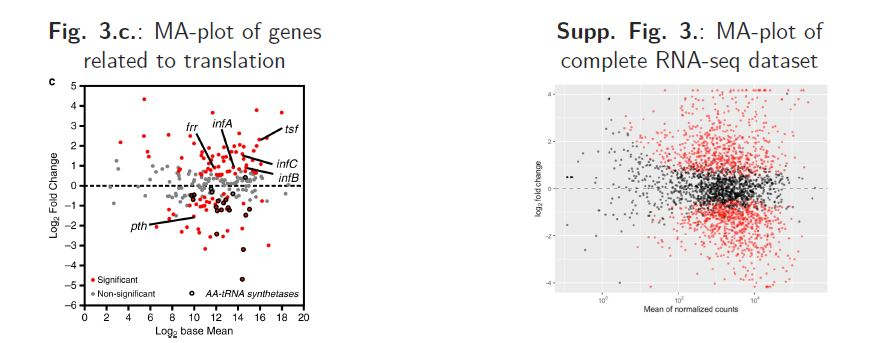
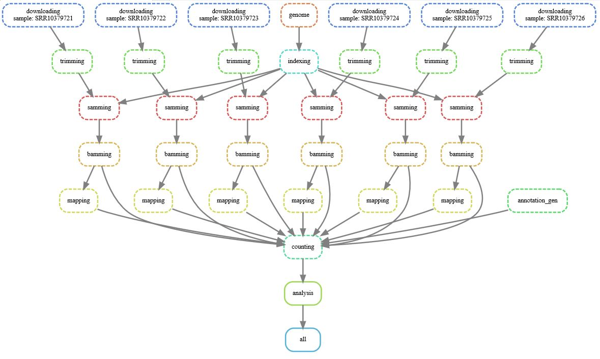
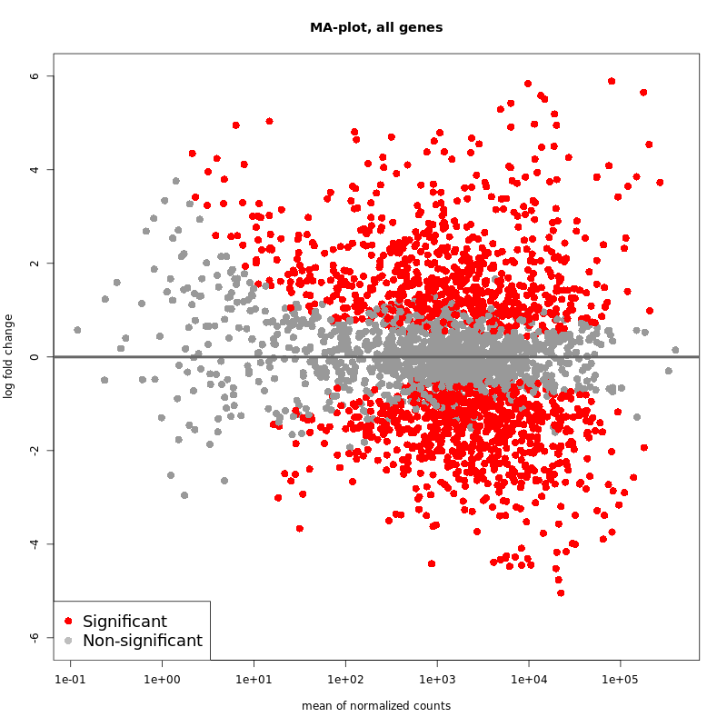

# Reprohackathon

Dépôt pour le projet dans le cadre de l'UC Reprohackathon.   
Formation IODAA AgroParisTech / Université Paris-Saclay.

## Table des matières

- Reprohackathon
    - Table des matières
    - Membres du groupe
    - Description du contexte
    - Description du projet
    - Fonctionnement du répertoire pour exécuter le workflow
    - Réalisations
    - Résultats obtenus
    - Conclusion

## Membres du groupe

- Maëlle CORNEC
- Suzanne GUILTEAUX
- Mathieu GUIMONT
- Gabriel CLEREMPUY

## Description du contexte

Ce cours a pour objectif de reproduire les résultats obtenus dans l'article *Intracellular Staphylococcus aureus persisters upon antibiotic exposure. Frédéric Peyrusson et al. Nat Commun. 2020 May 4;11(1):2200*.  
En particulier, l'objectif était de reproduire certaines figures de l'article portant sur la partie séquençage d'ARN d'échantillons contrôle et persistants de S.aureus. Les figures représentent l'analyse différentielle de l'expression génique :

   
Les premières séances ont servi à : 
- Introduire la problématique de la reproductibilté en bio-informatique.
- Se familiariser avec les outils qui seront à notre disposition pour la réalisation du projet :
    - le fonctionnement des machines virtuelles ;
    - le fonctionnement de VScode ;
    - la création d'environnemnt fermés par le biais de containers : Docker ;
    - la création d'un workflow : Snakemake.
  
Les séances suivantes étaient consacrées à la réalisation du projet lui-même.  

### Contexte de l'article

L'article porte sur les **cellules persistantes bactériennes**.
- **Variants phénotypiques** :
    - Etat de non-croissance transitoire. 
    - Tolérance aux antibiotiques.
- Généralement mis en évidence par des courbes de destruction biphasique :
    - Une grande partie de la population bactérienne est sensible et rapidement tuée.
    - Une sous-population a un « killing rate » plus faible et persiste pendant une période beaucoup plus longue 🡪 « persisters ».
- Persistance **non transmise génétiquement** (contrairement à la résistance).
- Phénotype **stable mais réversible** lors de l'élimination de l'antibiotique.  
   
Plus particulièrement, l'article s'intéresse au **cas du Staphylocoque doré**.
- Présence de S. aureus dans des cellules hôtes après un traitement antibiotique.
    - Suivi de sa dynamique de réplication et de sa division bactérienne grâce à des méthodes de fluorescence.
    - Observation d’un cas de destruction biphasique rapidement suivi d’un état non croissant et non répondant s’arrêtant avec l’arrêt du traitement.   
    🡺 Ce sont des **persisters**.   
- Les persisters :
    - **Métaboliquement actifs**. 
    - Mais un **profil transcriptomique altéré** qui correspond à l'activation des réponses au stress.
    - **Multirésistance aux médicaments** grâce aux réponses adaptatives redondantes.

### Résumé de l'article  

- **Objectif** : 
    - Comprendre les facteurs qui conduisent au switch de S. aureus vers le phénotype persistant et la tolérance aux antibiotiques. 
- **Méthodes** :
    - Fluorescence pour suivre la dynamique de S. aureus au sein de cellules hôtes.
    - Séquençage ARN pour connaître l’activité métabolique de S. aureus lors de cet état de persistance.
- **Résultats** :
    - Présence de variants phénotypiques persistants de S. aureus après un traitement antibiotique.
    - Réponse caractéristique de persisters.
    - Les persisters subissent une reprogrammation transcriptomique majeure et sont métaboliquement actifs.
    - Les persisters ajustent leur métabolisme carboné central (sans qu’il y ait de limitations sur l’ATP ou les acides aminés disponibles) et redirige leur transcription au profit d’un réseau de réponses adaptatives.
    - Les persisters sont capables de résister à plusieurs types d’antibiotiques alors qu’ils n'ont été exposés qu’à un seul.
- **Hypothèse** :
    - Les persistants intracellulaires de S. aureus pourraient constituer un réservoir pour les infections récidivantes et ainsi contribuer à l’échec des traitements.

### Résultats de l'article

**Gènes exprimés différemment**

- 1477 DEG :
    - **710 régulés *positivement*** :
        - Résistance au stress et à la famine (traduction toujours active).
        - Augmentation du métabolisme du galactose.
    - **767 régulés *négativement*** :
        - Baisse de l’activité métabolique lié à la prolifération (phosphorylation oxydative, métabolisme des nucléotides)

- Trois stimulons :
    - **SR (Stringent Response)** : (transitoire) traduction de (p)ppGpp inhibant indirectement des gènes.
    - **CWSS** : en réponse au stress de la paroi, les gènes impliqués tardivement dans la synthèse de peptidoglycanes sont stimulés.
    - **SOS** : stimulation de gènes impliqués dans la réparation par excision de l’ADN.

## Description du projet

- Création d'un workflow analysant les 6 séquences génétiques de S.aureus.
    - Téléchargement des séquences
    - Création des containers Docker utiles à l'analyse, en respectant autant que possible les versions des outils utilisés par l'étude.
    - Création des scripts d'analyse des séquences.
    - Intégration de ces éléments dans le workflow Snakemake.

## Fonctionnement du répertoire pour exécuter le workflow :
- Travail dans l'environnement BioPipes proposé sur l'IFB Cloud -> choisir une VM asez grande (taille standard)
- Dans l'environnement VS Code (après s'être connecté à la VM et avoir cloné le répertoire Reprohackathon2023), ouvrir le terminal et faire :
- ´conda init' (fermer et réouvrir le terminal)
- ´conda activate snakemake´. Vérifier la version de snakemake avec 'snakemake --version'. Elle doit être superieur à 7.
- Se déplacer dans le répertoire workflow avec ´cd workflow'.
- Executer le programme d'installation de singularity avec './install_singularity.sh'. Vérifier que singularity est bien installé avec ´singularity --version'. Cela doit être apptainer version 1.2.4.
- Exécuter le workflow avec la commande 'snakemake --use-singularity --cores'.

## Réalisations

Les trois parties suivantes sont traitées plus en détail dans le rapport disponible dans ce même dépôt. 
Les étapes effectuées et intégrées au pipeline pour reproduire l'expérience du papier peuvent se résumer avec l'image suivante :

Ces étapes comprennent : 
- le téléchargement des données à l'aide de SRAToolkit et des numéros SRR des six échantillons
- le téléchargement du génome de référence et de ses annotations
- le trimming des séquences pour le nettoyage de ces dernières avec l'outil TrimGalore 0.6.4
- l'indexation du génome avec l'outil Bowtie 0.12.7
- le mapping des six échantillons à l'aide de bowtie et samtools 
- le comptage des gènes à l'aide de l'outil featureCounts 1.4.6-p3
- et enfin l'analyse statistique avec R et DESeq2

## Résultats obtenus
L'analyse statistique permet de visualiser les résultats suivants : 

Sur ce second graphique, les gènes de la traduction ont été étiquetés. 

Pour comprendre et vérifier la cohérence de nos résultats, nous avons également réalisé un volcano-plot et une ACP pour tous les gènes et les gènes impliqués dans la traduction. Ces graphiques sont disponibles dans le rapport.

## Conclusion
Après comparaison avec les résultats de l'article, nos résultats sont, dans l'esprit, cohérents avec ceux de l'étude, malgré quelques différences détaillées dans le rapport (absence de certains gènes, davantage de gènes sous-exprimés...)
